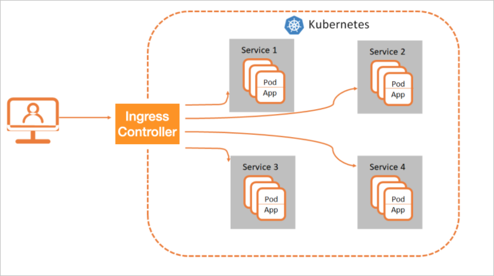

# K8s Nginx Ingress Controller 简介

在Kubernetes集群中，Ingress作为集群内服务对外暴露的访问接入点，几乎承载着集群内服务访问的所有流量。

Ingress是Kubernetes中的一个资源对象，用来管理集群外部访问集群内部服务的方式。您可以通过Ingress资源来配置不同的转发规则，从而实现根据不同的规则设置访问集群内不同的Service所对应的后端Pod。

## Ingress Controller工作原理

Ingress Controller用于解析Ingress的转发规则。Ingress Controller收到请求，匹配Ingress转发规则转发到后端Service所对应的Pod，由Pod处理请求。Kubernetes中Service、Ingress与Ingress Controller有着以下关系：

Service是后端真实服务的抽象，一个Service可以代表多个相同的后端服务。

Ingress是反向代理规则，用来规定HTTP、HTTPS请求应该被转发到哪个Service所对应的Pod上。例如根据请求中不同的Host和URL路径，让请求落到不同Service所对应的Pod上。

Ingress Controller是一个反向代理程序，负责解析Ingress的反向代理规则。如果Ingress有增删改的变动，Ingress Controller会及时更新自己相应的转发规则，当Ingress Controller收到请求后就会根据这些规则将请求转发到对应Service的Pod上。

Ingress Controller通过API Server获取Ingress资源的变化，动态地生成Load Balancer所需的配置文件，然后依次生成新的路由转发规则。

## Nginx Ingress Controller

Nginx Ingress Controller 是 Nginx 在 K8s 上 的 Controller 实现。

目前 K8s 官方维护的版本为： [https://github.com/kubernetes/ingress-nginx](https://github.com/kubernetes/ingress-nginx)

cmd 下的 命令包括：

- dataplane
- db
- nginx
- plugin
- waitshutdown

Nginx Ingress 控制器的目标是组装一个配置文件(nginx.conf)。这个要求的主要影响是在配置文件发生任何更改后需要重新加载NGINX。

但需要注意的是，当只有上游配置（即应用部署时端点变化）发生更改时，我们不会重新加载Nginx。我们使用lua-nginx-module来实现这一点。

## 参考

- [ingress-nginx/](https://kubernetes.github.io/ingress-nginx/)